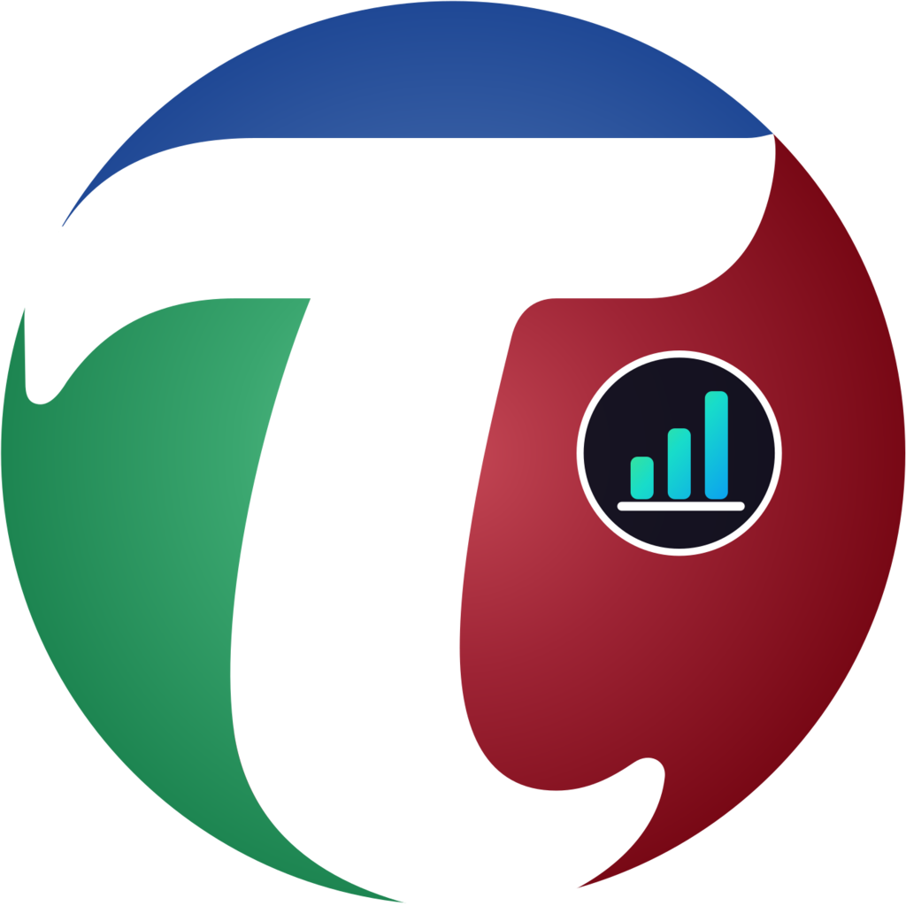

<p align="center">
  
</p>

<h1 align="center">Teloverge LLM Usage Monitor</h1>

<p align="center"><strong>Local token intelligence for Codex, the browser, and eventually a fleet of hosts.</strong></p>

LLM Usage Monitor reads local Codex and Claude Code history, stores normalized usage in SQLite, and presents automatic cost-first charts in a React browser app. The VS Code extension is a thin client for the same shared local server and starts it when necessary.

The dollar total is an **API-equivalent estimate**: what the selected token usage would cost at configured standard API rates. It is useful for comparing subscription usage with API pricing, but it is not a billing claim.

## Current capabilities

- Imports metadata from local Codex history files and local Claude Code session transcripts; it calls no vendor account servers.
- Prices cache reads and cache writes separately, because a read costs a fraction of base input while a write costs a premium over it.
- Never imports prompts, responses, reasoning text, tool calls, file contents, or credentials.
- Shows API-equivalent spend as a single headline figure with its cost drivers by harness, model, and task, plus token composition and per-source plan limits.
- Reads plan limits for each harness from what it already stores locally: Codex's session rate-limit events and Claude Code's own cached utilization block. Each meter is stamped with the time the reading was taken, and a window whose reset time has passed is withheld rather than shown at a percentage that no longer applies.
- Attributes usage to the Credential in effect when it happened — a subscription, an API key, or a cloud gateway — and groups and filters by it. Attribution begins at the first observation and is never backdated, so usage from before the monitor started watching reads as unattributed rather than being credited to a credential that may not have been in use. Codex states its credential outright; Claude Code's is inferred from the environment and is labelled as inferred.
- Separates usage source, harness, model provider, and model as distinct identities, so one harness may use several providers and one provider may be reached through several harnesses.
- Reports metrics a source does not supply as unavailable rather than as zero.
- Filters Today, rolling Last 24 hours, 7/30/90 days, all retained history, task name, and Source Host.
- Uses hostname as the preferred Source Host label and retains IP addresses as informative observations.
- Groups Source Hosts into user-defined Host Groups from Settings, effective from the moment they are saved.
- Stores canonical Usage Records, Source Hosts, effective-dated Host Group membership, prices, and import state in SQLite.
- Runs the browser and VS Code surfaces against one loopback-only Usage Monitor Server.

## Workspace structure

```text
apps/
  server/              authoritative local HTTP server, Codex and Claude importers
  web/                 React and Vite browser dashboard
  vscode-extension/    thin VS Code lifecycle and migration adapter
  source-host-agent/   future secondary-host collector and startup plans
packages/
  contracts/           strict versioned transport and domain schemas
  dashboard-actions/   one typed mutation interface
  usage-analysis/      canonical filtering, costing, and chart projections
  usage-ledger/        SQLite persistence and atomic imports
docs/architecture/     runtime and fleet design
CONTEXT.md             accepted domain vocabulary
```

## Develop and run

Prerequisites are native Node.js 24 or newer, Bun 1.3 or newer, and the Vite+ `vp` CLI. Bun remains the pinned package manager; use `vp` as the workflow entry point so dependency and task commands delegate consistently.

```powershell
vp install
vp run check
```

To build the React app and start the standalone server:

```powershell
vp run build:web
vp run build:server
node apps/server/dist/cli.mjs start --open
```

The server writes its discovery record and SQLite ledger beneath the current user's application-data directory. Set `LLM_USAGE_MONITOR_HOME` to use an isolated data directory, and `LLM_USAGE_MONITOR_WEB_DIR` to serve a different built web directory. The importers read `~/.codex` and `~/.claude`, overridable with `CODEX_HOME` and `CLAUDE_CONFIG_DIR`.

## VS Code extension

Build the complete runtime with `vp run build`. The extension bundle stages the server and built web app under `apps/vscode-extension/dist/runtime`.

When activated, the extension:

1. checks the per-user server discovery record;
2. reuses a healthy server if one exists;
3. otherwise starts the bundled server without a visible console using the configured Node.js 24+ executable;
4. creates a Windows system-tray menu for **Open Dashboard** and **Exit**;
5. performs a one-time, non-destructive migration of legacy VS Code `globalState` records;
6. opens the same browser dashboard used by the standalone server.

Set `llmUsageMonitor.nodePath` if `node` on `PATH` is not Node.js 24 or newer. The server is independent of the VS Code extension once running. Choosing **Exit** from the tray stops it and prevents background restart; **Open Dashboard** or **Refresh Codex History** explicitly starts it again.

## Source Host Agent

`apps/source-host-agent` reserves the secondary-host boundary. Its eventual startup mechanisms are per-user and non-elevated:

- Windows: Task Scheduler at user logon
- macOS: LaunchAgent
- Linux: systemd user service

Remote enrollment and upload intentionally fail closed in this branch. Before those commands are enabled, the agent needs authenticated enrollment, encrypted transport, replay protection, revocation, and bounded retry behavior. It will send normalized usage metadata to the primary Usage Monitor Server, never raw Codex JSONL.

See [portable-usage-host.md](docs/architecture/portable-usage-host.md) for the runtime and future fleet topology.

## Privacy and security boundary

The server binds only to `127.0.0.1`, uses a random unguessable route prefix, rejects cross-origin Dashboard Actions, limits request bodies, validates strict schemas, and uses parameterized SQLite statements. Local Codex files remain local. Future remote ingestion is not enabled merely because fleet-shaped storage exists.

## Cost semantics

Rates are USD per one million tokens and are editable in the dashboard. Cached input is priced separately when a rate exists. Reasoning output is a subset of output in Codex metadata and is not billed twice. Models without a configured price remain in token totals but contribute no estimated dollar amount.

## AI-Development Summary

Aside from a bit of manual tweaking, this application was generated by AI mostly using OpenAI GPT-5.6-Sol Medium and then redesigned with Claude Opus 5. Revision 0.2.0 was refactored using Matt Pocock's `codebase-design` skill. The sample images depict these AI-assisted tasks:
